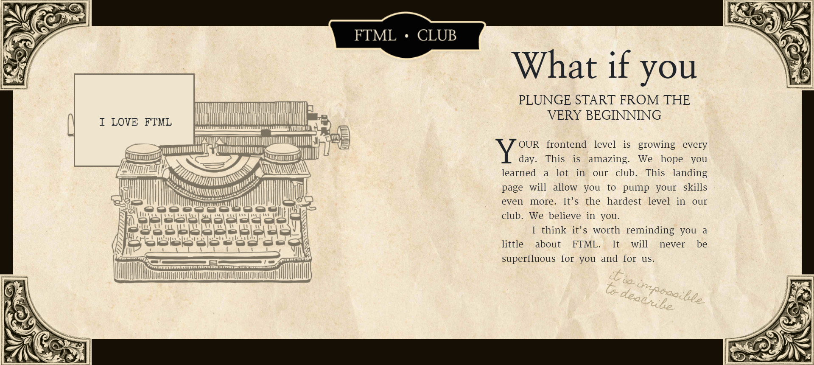
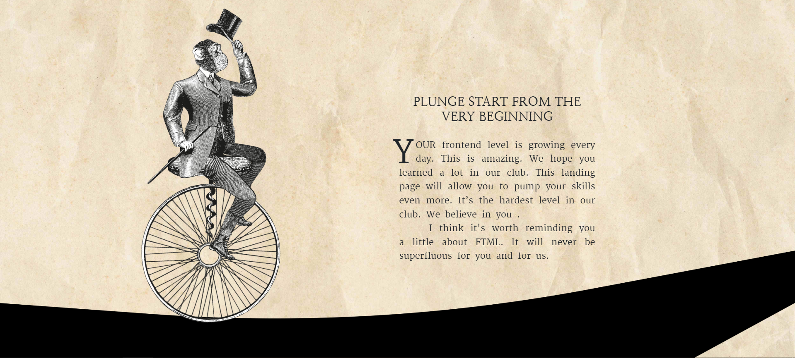

<!-- PROJECT LOGO -->
 

  <h3 align="center">Landing for FTML</h3>
  

    🖨️🐒 Website with animation in retro style
     
     
    <a href="https://oleinikovapolina.github.io/landing-for-FTML-2/">View Demo</a>
  

<!-- TABLE OF CONTENTS -->

  
Table of Contents

  <ol>
    <li><a href="#features">Features</a></li>
    <li><a href="#built-with">Built With</a></li>
  </ol>

 

<!-- FEATURES -->
<h2 id="features">✨ Features</h2>

* fullscreen content slider
* flying balloon animation
* lettering animation
* typewriter animation
* soaring notes
* animation of a monkey with a hat on a unicycle along an emerging track
* old phone animation

(<a href="#top">back to top</a>)

<!-- BUILT WITH -->
<h2 id="built-with">🏗️ Built With</h2>

* html
* css
* js
* bootstrap

(<a href="#top">back to top</a>)

